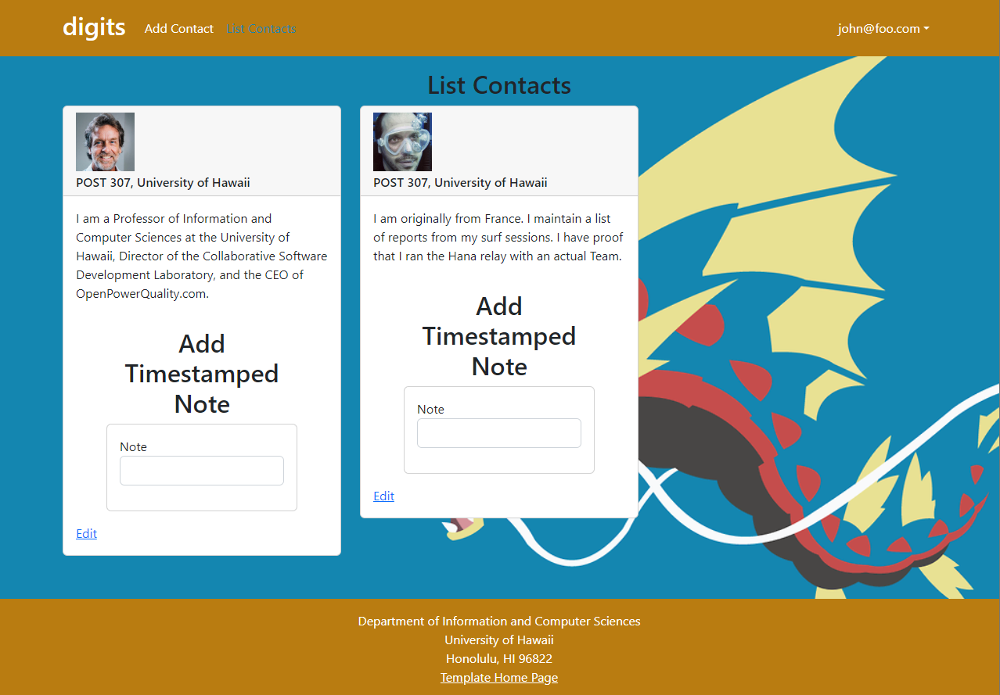

# Digits 

## The landing page 

This is the landing page where user first come to on the website. To create the landing page. I used a react bootstrap. To create the multiple users, contact details and time stamped notes, i created a row and inside the row they are three column. The three columns each represent the titles above. 

## Add Contact Page

In the add contact page. Im using react bootstrap to create components. I have 4 textfield labeled as first name, last name, address, image. The description is longtextfield and finally a submit button. The contact field will be stored in a data base, where it will later be called to display information as a card (later explained).

## List Contact Page

The list contact page pulls the field that was written in the add contact page and displays it as a card. I reference the card from react bootstrap documentation. We also added a hyper link that is connected to an edit contact page where data field can be connected. Finally we added a Note that saves the time and information written. The note has it own collection where it will save note, contact ID, created time and owner as fields.

